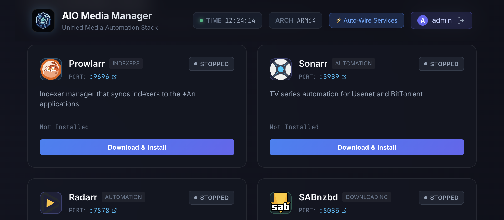
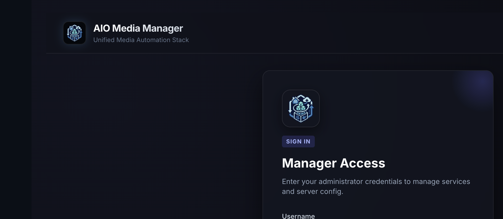

# AIO Media Server Manager

<p align="center">
  
</p>

<p align="center">
  <strong>One appliance for a complete Usenet and BitTorrent media stack.</strong><br />
  Install, supervise, and wire every application as a process — not a container per app.
</p>

<p align="center">
  <a href="https://github.com/Qballjos/aio-media-server-manager/actions/workflows/ci.yml"></a>
  <a href="https://github.com/Qballjos/aio-media-server-manager/pkgs/container/aio-media-server-manager"></a>
  <a href="LICENSE"></a>
  
</p>

You run **one** Docker container (or one native service). The manager installs binaries, starts them under a process supervisor, configures folders and API wiring, and presents a single dashboard. There is no per-app Compose stack and **no Debrid** functionality.

---

## Screenshots

<p align="center">
  
</p>

<p align="center"><em>Catalog dashboard — search, category filters, popularity sort, official icons, and per-app help.</em></p>

<p align="center">
  
</p>

<p align="center"><em>Local administrator setup and sign-in before the first-run stack wizard.</em></p>

---

## Why this exists

Typical *Arr deployments become a Compose file per application: Sonarr, Radarr, Prowlarr, qBittorrent, Jellyfin, and a dozen sidecars. This project treats that stack as **one appliance**.

| You get | You do not get |
|---------|----------------|
| One image, one process tree | A generator of per-app containers |
| Automatic indexer, downloader, and library wiring | Debrid, Zurg, Riven, or cloud mounts |
| First-run wizard for the stack you actually want | A second Docker network per service |
| amd64 and ARM64 (NAS-friendly) | Kubernetes or extra brokers |

---

## Capabilities

- **Process supervisor** — start, stop, restart, crash-loop detection, log tails, and graceful shutdown.
- **Catalog installers** — GitHub releases, official binaries (Jellyfin, Plex), and PyPI applications.
- **First-run wizard** — pick *Arr apps, download clients (including Usenet provider fields), media servers, VPN, and recommended tools; persist paths and credentials; start installs. Admin setup requires an email.
- **Shared local login** — the manager admin username, email, and password are applied to apps that support a local account (*Arr, download clients, Bazarr, Jellyfin, Seerr). Plex still uses a Plex account.
- **Automatic wiring** — after an app is healthy: categories, root folders, Prowlarr sync, Seerr, Bazarr pairing, and starter configs for Recyclarr / Profilarr / NeutArr.
- **Storage model** — `config`, `downloads`, and `media` with `PUID` / `PGID` and hardlink checks.
- **VPN isolation** — qBittorrent and Prowlarr can run in a Linux network namespace bound to WireGuard or OpenVPN; Usenet stays off the tunnel.
- **Hardware transcoding** — VAAPI / QSV / NVIDIA when the host exposes devices.
- **Optional Cloudflare Tunnel** — `cloudflared` runs inside this appliance, not as a second Compose service.
- **Dashboard** — official app logos, help/wiki links, search and sort, Health graphs, updates, backups, and uninstall.
- **Open UI** — each catalog card opens `http://<host>:<app-port>`. Compose (and the NAS templates) publish those ports; host networking is an alternative.
- **Settings** — account, timezone, PUID/PGID, backups, VPN, Cloudflare Tunnel, GitHub token, scheduled catalog updates, and a debug-share toggle.
- **Scheduled updates** — Settings → Updates checks GitHub on a timer (notify only or auto-apply). Manual **Update** on a card still snapshots and rolls back on failure.

---

## Application catalog

Seventeen applications ship in the catalog. Install only what you select.

| Role | Applications |
|------|----------------|
| Indexers | Prowlarr, Flaresolverr |
| Automation | Sonarr, Radarr, Lidarr |
| Downloaders | SABnzbd, NZBGet, qBittorrent |
| Media servers | Jellyfin, Plex (may share the same libraries) |
| Requests | Seerr, Shelfmark |
| Books | Grimmory |
| Subtitles | Bazarr |
| Profiles | Recyclarr, Profilarr, NeutArr |

Each catalog card includes a help control that opens that project's official wiki or documentation.

---

## Documentation

| Guide | Contents |
|-------|----------|
| [Installation](docs/INSTALL.md) | Host folders, ports, platform index |
| [Usage](docs/USAGE.md) | First-run wizard, catalog, Settings, scheduled updates |
| [Docker](deploy/DOCKER.md) | Primary deployment |
| [Linux / LXC](deploy/LINUX.md) · [Unraid](deploy/UNRAID.md) · [Synology](deploy/SYNOLOGY.md) · [TrueNAS](deploy/TRUENAS.md) | Platform notes |
| [Cloudflare Tunnel](deploy/CLOUDFLARE.md) | Remote access without inbound ports |
| [Contributing](CONTRIBUTING.md) | Development workflow |

---

## Install

Create bind-mount directories on the host (downloads and media as children of **one** folder so hardlinks work), then run the published image.

```bash
sudo mkdir -p /opt/aio-media-manager/{config,data/downloads,data/media}
docker pull ghcr.io/qballjos/aio-media-server-manager:latest
docker compose up -d
```

Open `http://<host>:8080`. Create the administrator, complete the stack wizard, then use the dashboard to install and start applications.

Image tags: `latest` (main), `sha-<git>`, and semver when a `v*` tag is pushed. Architectures: `linux/amd64`, `linux/arm64`. The image runs the manager on Python 3.14 and ships a Python 3.13 runtime for child apps that need it (Bazarr). After a pull, **recreate** the container so new port mappings and the 3.13 runtime take effect.

Full steps: [docs/INSTALL.md](docs/INSTALL.md) · [deploy/DOCKER.md](deploy/DOCKER.md).

---

## Development

**Prerequisites:** Python 3.11+, [Poetry](https://python-poetry.org/), Node.js 22.

```bash
git clone https://github.com/Qballjos/aio-media-server-manager.git
cd aio-media-server-manager
cp .env.example .env
poetry install
cd frontend && npm ci && npm run build && cd ..
poetry run python main.py
```

| URL | Purpose |
|-----|---------|
| http://localhost:8080 | Manager UI |
| http://localhost:8080/docs | OpenAPI |

For a live dashboard, run `npm run dev` in `frontend/` as well. Tests: `poetry run pytest`.

---

## License

[MIT](LICENSE)
