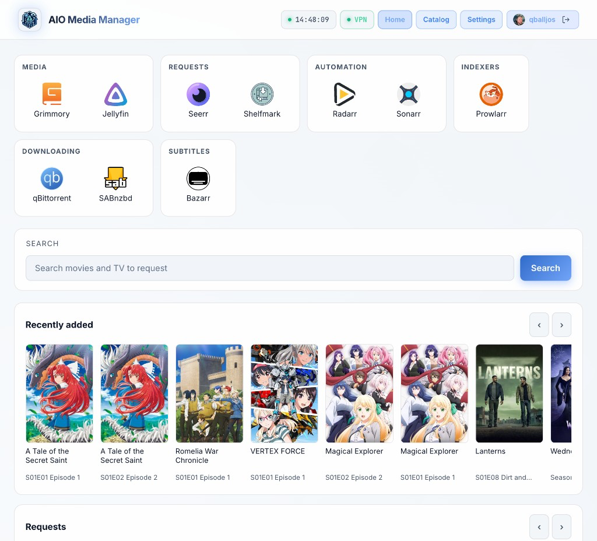
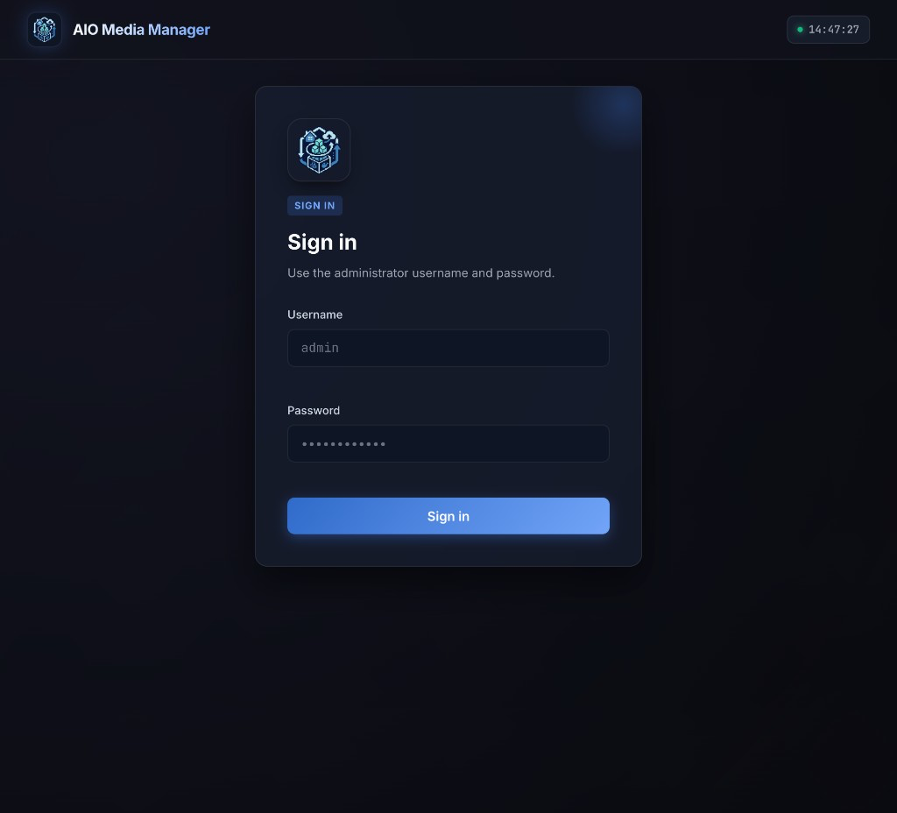

# AIO Media Server Manager

<p align="center">
  
</p>

<p align="center">
  <strong>One Linux appliance for a complete Usenet and BitTorrent media stack.</strong><br />
  Install, supervise, and wire every application as a process — not a container per app.
</p>

<p align="center">
  <a href="https://github.com/Qballjos/aio-media-server-manager/actions/workflows/ci.yml"></a>
  <a href="https://github.com/Qballjos/aio-media-server-manager/pkgs/container/aio-media-server-manager"></a>
  <a href="LICENSE"></a>
  
</p>

You run **one** Docker container (or one native Linux service). The manager installs binaries, starts them under a process supervisor, configures folders and API wiring, and presents a single web UI. There is no per-app Compose stack and **no Debrid** functionality.

---

## Screenshots

<p align="center">
  
</p>

<p align="center"><em>Catalog — search, category filters, popularity sort, official icons, and per-app help.</em></p>

<p align="center">
  
</p>

<p align="center"><em>Local administrator setup and sign-in before the first-run stack wizard.</em></p>

---

## Why this exists

Typical *Arr deployments become a Compose file per application: Sonarr, Radarr, Prowlarr, qBittorrent, Jellyfin, and a dozen sidecars. This project treats that stack as **one appliance**.

| Included | Not included |
|----------|----------------|
| One image, one process tree | A generator of per-app containers |
| Automatic indexer, downloader, and library wiring | Debrid, Zurg, Riven, or cloud mounts |
| First-run wizard for the stack you actually want | A second Docker network per service |
| `linux/amd64` and `linux/arm64` (NAS-friendly) | Kubernetes or extra brokers |

---

## Features

**Lifecycle.** Start, stop, restart, crash-loop detection, leftover-process reclaim, log tails, and graceful shutdown. Uninstall stops the process, then removes its install tree.

**Install and catalog.** GitHub releases, official binaries (Jellyfin, Plex), and PyPI applications. The catalog and first-run wizard only list applications that support the host CPU architecture (Flaresolverr is x86_64-only).

**First-run wizard.** Choose *Arr apps, download clients (including Usenet provider fields), media servers, VPN, and recommended tools. Persist paths and credentials, then install. Administrator setup requires an email address.

**Shared local login.** The manager admin username, email, and password are applied to apps that support a local account (*Arr, download clients, Bazarr, Jellyfin, Seerr). Plex still uses a Plex account.

**Automatic wiring.** After an app is healthy — or when you click **Auto-Wire** — the manager configures categories, root folders, download clients in Sonarr/Radarr, Prowlarr sync, Seerr, Bazarr pairing, and starter configs for Recyclarr, Profilarr, and NeutArr.

**Home Dashboard.** Launcher plus calendar, downloads, recently added, and Seerr search. Widget diagnostics live under **Settings → Debug** (empty tiles explained; API keys never shown).

**Operations.** `config` / `downloads` / `media` with `PUID` / `PGID` and hardlink checks. Optional WireGuard or OpenVPN isolation for qBittorrent, Prowlarr, and Flaresolverr (Usenet stays off the tunnel). Optional VAAPI / QSV / NVIDIA transcoding. Optional Cloudflare Tunnel (`cloudflared` inside this appliance). Configuration backups with verify, per-app restore, and a schedule.

**Open UI.** Each catalog card opens `http://<host>:<app-port>`. Compose and the NAS templates publish those ports; host networking is an alternative. qBittorrent can use the stock WebUI or [VueTorrent](https://github.com/VueTorrent/VueTorrent) from Catalog → qBittorrent → Settings (same port and WebAPI).

---

## Application catalog

Seventeen applications are defined. Install only what you select. Entries that cannot run on the current architecture are omitted from the catalog and the wizard.

| Role | Applications |
|------|----------------|
| Indexers | Prowlarr, Flaresolverr (x86_64) |
| Automation | Sonarr, Radarr, Lidarr |
| Downloaders | SABnzbd, NZBGet, qBittorrent (optional VueTorrent WebUI) |
| Media servers | Jellyfin, Plex (may share the same libraries) |
| Requests | Seerr, Shelfmark |
| Books | Grimmory |
| Subtitles | Bazarr |
| Profiles | Recyclarr, Profilarr, NeutArr |

Each catalog card includes a help control that opens that project's official documentation.

---

## Documentation

| Guide | Contents |
|-------|----------|
| [Installation](docs/INSTALL.md) | Host folders, ports, platform index |
| [Usage](docs/USAGE.md) | Wizard, Home Dashboard, catalog, Auto-Wire, Settings |
| [Docker](deploy/DOCKER.md) | Primary deployment |
| [Linux / LXC](deploy/LINUX.md) · [Unraid](deploy/UNRAID.md) · [Synology](deploy/SYNOLOGY.md) · [TrueNAS](deploy/TRUENAS.md) | Platform notes |
| [Cloudflare Tunnel](deploy/CLOUDFLARE.md) | Remote access without inbound ports |
| [Contributing](CONTRIBUTING.md) | Development workflow |

---

## Install

Create bind-mount directories on the host (downloads and media as children of **one** folder so hardlinks work), then run the published image.

```bash
sudo mkdir -p /opt/aio-media-manager/{config,data/downloads,data/media,backups}
docker pull ghcr.io/qballjos/aio-media-server-manager:latest
docker compose up -d
```

Open `http://<host>:8080`. Create the administrator, complete the stack wizard, then use Catalog to install and start applications.

Image tags: `latest` (main), `sha-<git>`, and semver when a `v*` tag is pushed. Architectures: `linux/amd64`, `linux/arm64`. The image runs the manager on Python 3.14 and ships a Python 3.13 runtime for child apps that need it (Bazarr). After a pull, **recreate** the container so new port mappings and the 3.13 runtime take effect.

Full steps: [docs/INSTALL.md](docs/INSTALL.md) · [deploy/DOCKER.md](deploy/DOCKER.md).

---

## Development

The appliance is a **Linux container**. Catalog installs (Sonarr, Jellyfin, qBittorrent-nox, Flaresolverr, and others) are Linux binaries. Do not run the manager natively on macOS or Windows to test installs.

```bash
git clone https://github.com/Qballjos/aio-media-server-manager.git
cd aio-media-server-manager
./scripts/test-env.sh up
```

Open **http://127.0.0.1:8080**. Data for this run is under `.docker-test/` (gitignored). Stop with `./scripts/test-env.sh down`. Remove `.docker-test/` to wipe test config and libraries.

| URL | Purpose |
|-----|---------|
| http://127.0.0.1:8080 | Manager UI (dashboard built into the image) |
| http://127.0.0.1:8080/docs | OpenAPI |

Optional live Vue reload (API still in Docker): `cd frontend && npm ci && npm run dev`, then use **http://127.0.0.1:5173**. Unit tests: `poetry run pytest`. Full workflow: [CONTRIBUTING.md](CONTRIBUTING.md).

---

## Security

Report vulnerabilities through [GitHub private advisories](https://github.com/Qballjos/aio-media-server-manager/security/advisories/new), not public issues.

---

## License

[MIT](LICENSE)
