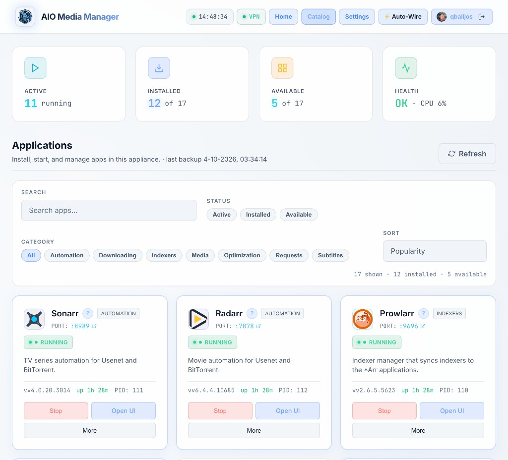
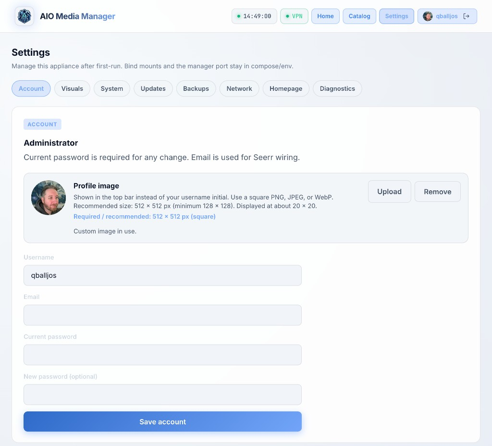

# AIO Media Server Manager

<p align="center">
  
</p>

<p align="center">
  <strong>One install for your whole home media stack.</strong><br />
  Sonarr, Radarr, download clients, and players run inside a single appliance — not a container per app.
</p>

<p align="center">
  <a href="https://qballjos.github.io/aio-media-server-manager/"></a>
  <a href="https://github.com/Qballjos/aio-media-server-manager/actions/workflows/ci.yml"></a>
  <a href="https://github.com/Qballjos/aio-media-server-manager/pkgs/container/aio-media-server-manager"></a>
  <a href="LICENSE"></a>
  
  
</p>

You run **one** Docker container (or one native Linux service). AIO installs the apps you choose, starts them, wires folders and APIs together, and gives you one web dashboard. There is no per-app Compose stack and no Debrid functionality.

**This project was vibe coded** — built with AI pair-programming in Cursor, guided by a human who wanted one appliance instead of a Compose novel. Expect a fast-moving stack; issues and PRs are welcome when something feels off.

---

## Screenshots

<p align="center">
  
</p>

<p align="center"><em>Administrator sign-in before the home dashboard.</em></p>

<p align="center">
  
</p>

<p align="center"><em>Home — app launcher, search, recently added, and requests.</em></p>

<p align="center">
  
</p>

<p align="center"><em>Catalog — install, start, Open UI, and per-app controls.</em></p>

<p align="center">
  
</p>

<p align="center"><em>Settings — account, system, network, backups, and more.</em></p>

---

## Why this exists

Most *Arr setups turn into a long Compose file: one container for Sonarr, one for Radarr, one for qBittorrent, and so on. This project treats the stack as **one appliance** you install once.

| You get | You do not get |
|---------|----------------|
| One image, one process tree | A generator of per-app containers |
| Automatic wiring between indexers, downloaders, and libraries | Debrid services or cloud remotes |
| A first-run wizard for the apps you actually want | A second Docker network per service |
| `linux/amd64` and `linux/arm64` (NAS-friendly) | Kubernetes or extra brokers |

---

## Features

**Lifecycle.** Start, stop, restart, crash-loop detection, leftover-process reclaim, log tails, and graceful shutdown. Uninstall stops the process, then removes its install tree.

**Install and catalog.** GitHub releases, official binaries (Jellyfin, Plex), and PyPI applications. The catalog and first-run wizard only list applications that support the host CPU architecture (Flaresolverr is x86_64-only).

**First-run wizard.** Choose *Arr apps, download clients (including Usenet provider fields), media servers, VPN, an optional Cloudflare Tunnel, and recommended tools. The tunnel and the VPN start as soon as the wizard finishes. Persist paths and credentials, then install. Administrator setup requires an email address.

**Shared local login.** The manager admin username, email, and password are applied to apps that support a local account (*Arr, download clients, Bazarr, Jellyfin). Seerr's admin is created by signing in with that Jellyfin account (or the claimed Plex token), and its first-run wizard is completed for you. Plex still uses a Plex account.

**Automatic wiring.** After an app is healthy — or when you click **Auto-Wire** — the manager configures categories, root folders, download clients in Sonarr/Radarr, Prowlarr sync, Seerr, Bazarr pairing, and starter configs for Recyclarr and NeutArr. Prowlarr also gets a starter set of public indexers (1337x, The Pirate Bay, YTS, Nyaa.si, LimeTorrents, Knaben) with seed settings (ratio 1, 48 hours, season packs 7 days), and FlareSolverr is attached to the ones Cloudflare blocks. Remove any you do not want; they are not added back.

**Home.** Launcher plus calendar, downloads, recently added, and Seerr search. Widget diagnostics live under **Settings → Homepage** (empty tiles explained; API keys never shown).

**Visuals.** Dark / light / system theme, accent color, custom header title, and replaceable header icon, login logo, and favicon under **Settings → Visuals**.

**Operations.** `config` / `downloads` / `media` with `PUID` / `PGID` and hardlink checks. Optional WireGuard or OpenVPN isolation for qBittorrent, Prowlarr, and Flaresolverr (Usenet stays off the tunnel). Optional VAAPI / QSV / NVIDIA transcoding. Optional Cloudflare Tunnel (`cloudflared` inside this appliance). Configuration backups with verify, per-app restore, and a schedule.

**Open UI.** Each catalog card opens `http://<host>:<app-port>`. On the LAN, apps with a local login (Sonarr, Radarr, Lidarr, Prowlarr, qBittorrent, SABnzbd, Bazarr, Seerr) open already signed in as the manager admin: the manager signs in server-side and hands the session to your browser. Jellyfin, Plex, and NZBGet keep their own login, and so does every app on public subdomains. Compose and the NAS templates publish those ports; host networking is an alternative. qBittorrent uses [VueTorrent](https://github.com/VueTorrent/VueTorrent) by default (same port and WebAPI). Catalog → qBittorrent → Settings can switch to the stock WebUI or **Update VueTorrent** (re-downloads the latest UI zip; not part of Catalog app updates). Catalog → NeutArr → Settings shows NeutArr's first-run setup token while `/config/neutarr/.setup-token` exists. NeutArr removes that file after account creation.

---

## Application catalog

Sixteen applications are defined. Install only what you select. Entries that cannot run on the current architecture are omitted from the catalog and the wizard.

| Role | Applications |
|------|----------------|
| Indexers | Prowlarr, Flaresolverr (x86_64) |
| Automation | Sonarr, Radarr, Lidarr |
| Downloaders | SABnzbd, NZBGet, qBittorrent (VueTorrent WebUI by default) |
| Media servers | Jellyfin, Plex (may share the same libraries) |
| Requests | Seerr, Shelfmark |
| Books | Grimmory |
| Subtitles | Bazarr |
| Profiles | Recyclarr, NeutArr |

Each catalog card includes a help control that opens that project's official documentation.

---

## Documentation

**Start here:** [qballjos.github.io/aio-media-server-manager](https://qballjos.github.io/aio-media-server-manager/)  
(Plain-language guides, published from this repo with GitHub Pages.)

| Guide | What it covers |
|-------|----------------|
| [Install](docs/INSTALL.md) | Folders, ports, which platform guide to open |
| [Using the dashboard](docs/USAGE.md) | First run, enabling apps, Open UI, common snags |
| [Docker](deploy/DOCKER.md) | Recommended way to run AIO |
| [Linux](deploy/LINUX.md) · [Unraid](deploy/UNRAID.md) · [Synology](deploy/SYNOLOGY.md) · [TrueNAS](deploy/TRUENAS.md) | Platform-specific steps |
| [Cloudflare Tunnel](deploy/CLOUDFLARE.md) | Remote HTTPS without opening router ports |
| [Cloudflare Access](deploy/CLOUDFLARE_ACCESS.md) | Login gate on those public URLs |
| [Contributing](CONTRIBUTING.md) | Development workflow |

Local preview: `bash scripts/prepare-docs-site.sh && pip install -r requirements-docs.txt && mkdocs serve`

---

## Install

Create bind-mount directories on the host (downloads and media as children of **one** folder in your home so hardlinks work and the file manager can see them), then run the published image.

```bash
mkdir -p "$HOME/aio-media-manager/downloads" "$HOME/aio-media-manager/media"
sudo mkdir -p /opt/aio-media-manager/{config,backups}
docker pull ghcr.io/qballjos/aio-media-server-manager:latest
docker compose up -d
```

Open `http://<host>:8080`. Create the administrator, complete the stack wizard, then use Catalog to install and start applications.

Image tags: `latest` (main), `sha-<git>`, and semver when a `v*` tag is pushed. Architectures: `linux/amd64`, `linux/arm64`. The manager runs on Python 3.14. Child runtimes on both architectures: Python 3.13 (Bazarr / SABnzbd), Node 22 (Seerr), JRE 25 and MariaDB (Grimmory), ffmpeg (Jellyfin / Plex), git (Recyclarr). Chromium/Xvfb ship only on `linux/amd64` for Flaresolverr. After a pull, **recreate** the container so new port mappings and runtimes take effect.

Full steps: [docs/INSTALL.md](docs/INSTALL.md) · [deploy/DOCKER.md](deploy/DOCKER.md).

---

## Development

The appliance is a **Linux container**. Catalog installs (Sonarr, Jellyfin, qBittorrent-nox, Flaresolverr, and others) are Linux binaries. Do not run the manager natively on macOS or Windows to test installs.

```bash
git clone https://github.com/Qballjos/aio-media-server-manager.git
cd aio-media-server-manager
./scripts/test-env.sh up
```

Open **http://127.0.0.1:8080**. Data for this run is under `.docker-test/` (gitignored). Stop with `./scripts/test-env.sh down`. Remove `.docker-test/` to wipe test config and libraries.

| URL | Purpose |
|-----|---------|
| http://127.0.0.1:8080 | Manager UI (dashboard built into the image) |
| http://127.0.0.1:8080/docs | OpenAPI |

Optional live Vue reload (API still in Docker): `cd frontend && npm ci && npm run dev`, then use **http://127.0.0.1:5173**. Unit tests: `poetry run pytest`. Full workflow: [CONTRIBUTING.md](CONTRIBUTING.md).

---

## Security

Report vulnerabilities through [GitHub private advisories](https://github.com/Qballjos/aio-media-server-manager/security/advisories/new), not public issues.

---

## License

[MIT](LICENSE)
