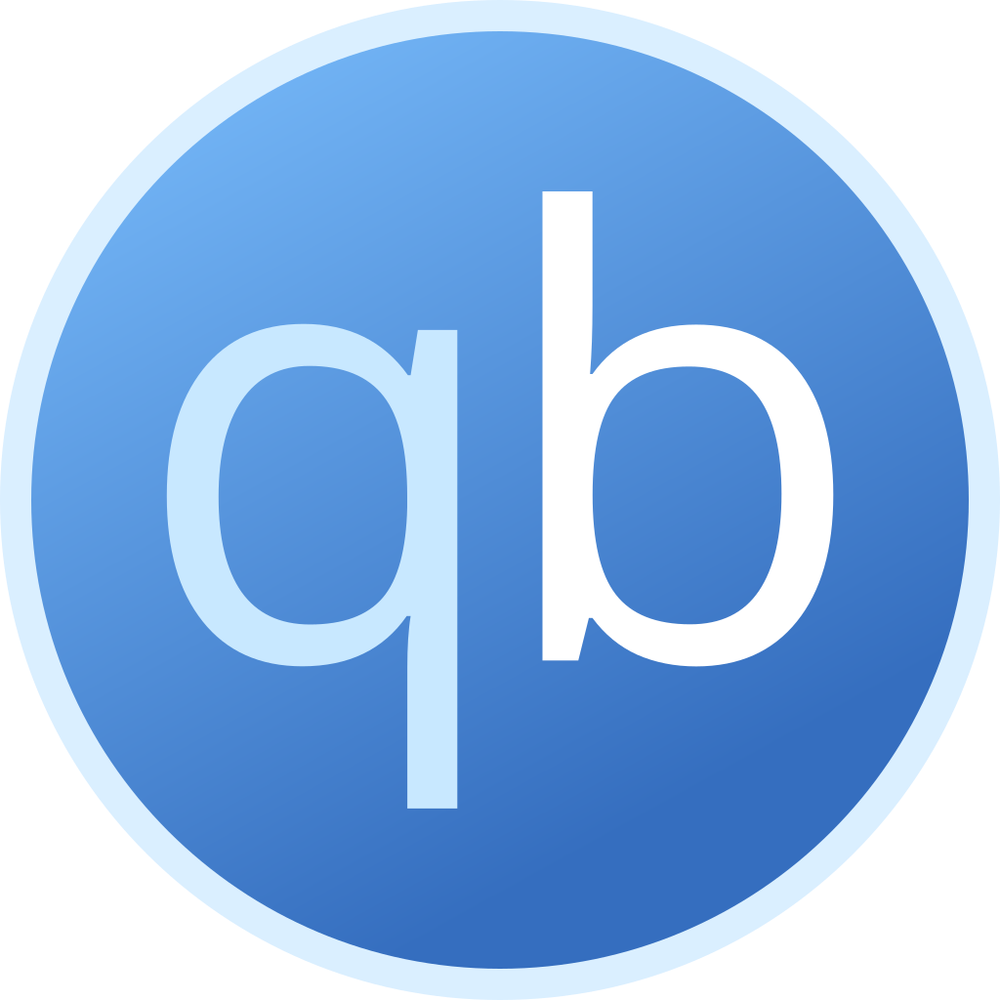
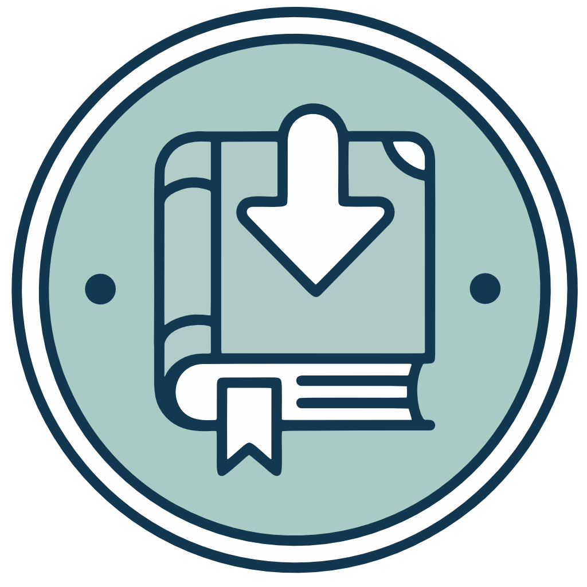
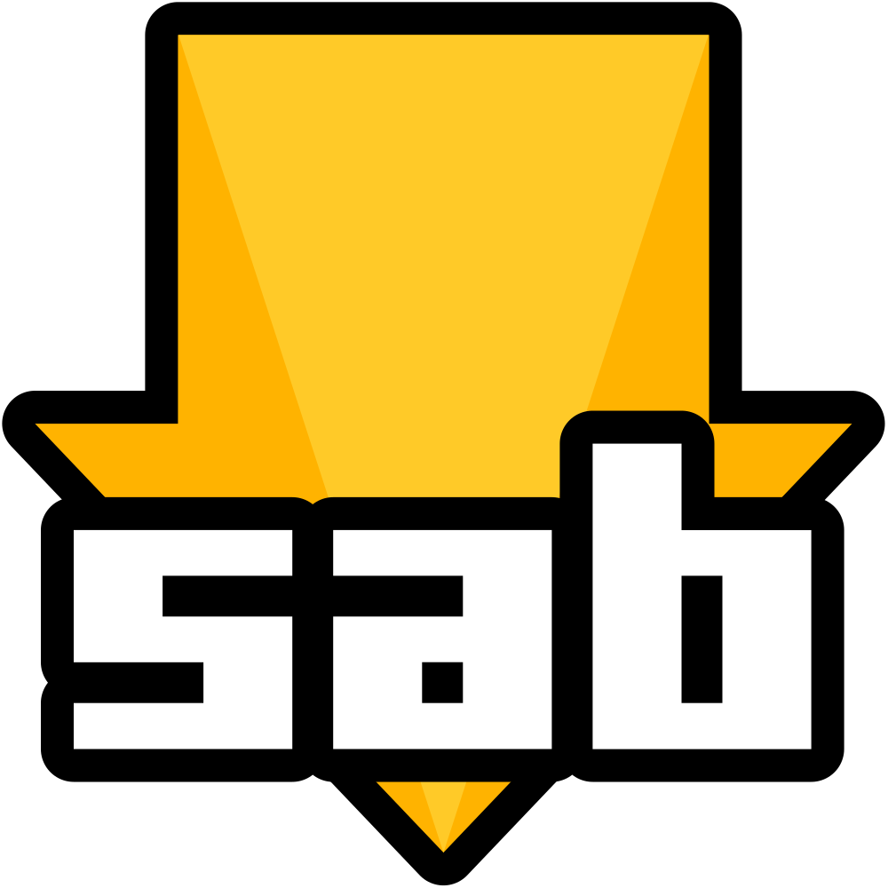
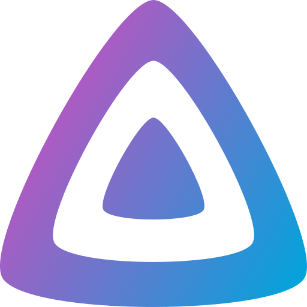
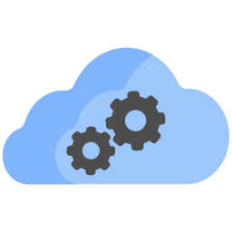
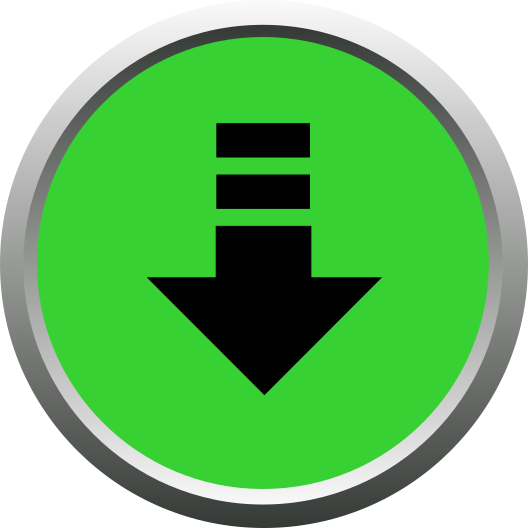
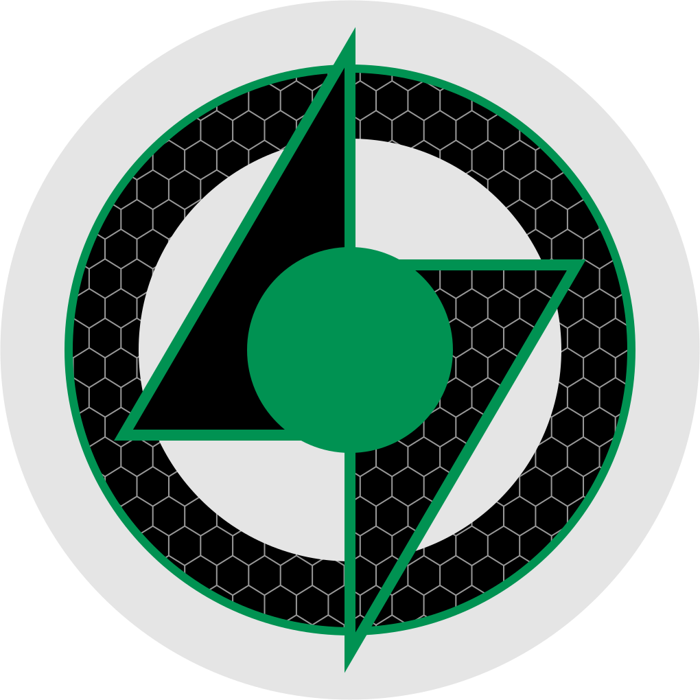
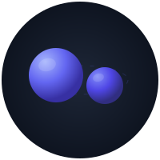
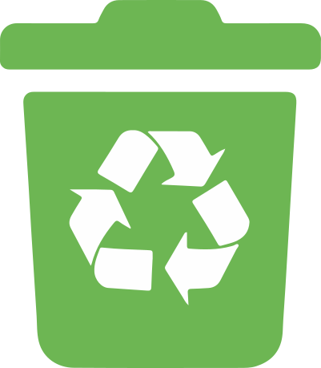

# Install

Get AIO running in three steps: create folders, start the app, open the dashboard.

!!! tip "Prefer a short path?"
    Most people start with **[Docker](deploy/DOCKER.md)** or their NAS guide (**[Unraid](deploy/UNRAID.md)** · **[Synology](deploy/SYNOLOGY.md)** · **[TrueNAS](deploy/TRUENAS.md)**), then come back here for ports and updates.

## Before you start

1. **Pick where it will run** — Unraid, Synology, TrueNAS, plain Docker, or native Linux.
2. **Plan two kinds of storage:**
   - **Config** — settings and databases (small, back this up)
   - **Downloads + media** — the big files (keep these on the **same** disk/share so hardlinks work)
3. **Know your user ID** — on Linux/NAS, apps often run as a specific user (`PUID` / `PGID`). Match that to who owns your folders so you do not get permission errors.

You only need **one** AIO container. Do not install Sonarr, Radarr, or download clients as separate apps alongside it.

**Image:** `ghcr.io/qballjos/aio-media-server-manager:latest`  
**Architectures:** `linux/amd64`, `linux/arm64` (Flaresolverr is x86_64-only and hidden on ARM)

## Choose your platform

| Where you run it | Guide |
|------------------|--------|
| Docker (any host) | [Docker](deploy/DOCKER.md) |
| Unraid | [Unraid](deploy/UNRAID.md) |
| Synology | [Synology](deploy/SYNOLOGY.md) |
| TrueNAS SCALE | [TrueNAS](deploy/TRUENAS.md) |
| Debian / Ubuntu / Proxmox LXC (no Docker) | [Linux](deploy/LINUX.md) |
| All options listed | [Deploy overview](deploy/README.md) |

Each platform guide starts with: open SSH → create folders → start AIO.

## Folders on the host

SSH in, then create something like this (paths vary by platform — follow your guide):

```bash
ssh user@host

mkdir -p "$HOME/aio-media-manager/downloads" "$HOME/aio-media-manager/media"
sudo mkdir -p /path/to/config /path/to/config/vpn /path/to/backups
id   # note uid= (PUID) and gid= (PGID)
sudo chown -R "$PUID:$PGID" "$HOME/aio-media-manager" /path/to/config /path/to/backups
```

Keep **downloads** and **media** as siblings under one folder so *Arr can hardlink. Mount a separate **backups** folder at `/backups` if you can (ideally another disk than config).

Inside those mounts AIO lays out libraries such as `media/tv`, `media/movies`, and `downloads/complete`.

## After it starts

1. Open the dashboard: `http://YOUR-SERVER-IP:8080`  
   (Use a different port if you mapped one.)
2. Create the admin account (username, **email**, password).
3. Follow [Using the dashboard](USAGE.md) to enable apps and open each web UI.

After `docker compose pull`, **recreate** the container (not only restart) so new ports and runtimes apply.

## Optional: reach apps from outside your home

1. [Cloudflare Tunnel](deploy/CLOUDFLARE.md) — HTTPS without opening router ports  
2. [Cloudflare Access](deploy/CLOUDFLARE_ACCESS.md) — login gate so strangers cannot open admin apps

## Ports {#ports}

The manager UI uses **8080**. Child apps listen inside the same container. Compose and NAS templates publish those ports on the host so **Open UI** works (`http://YOUR-IP:8989` for Sonarr, and so on). Host networking is an alternative if you prefer not to map each port.

| Application | Default port |
|-------------|--------------|
|  Manager UI | 8080 |
|  qBittorrent | 8081 |
|  Shelfmark | 8084 |
|  SABnzbd | 8085 |
|  Jellyfin | 8096 |
|  Flaresolverr | 8191 (x86_64 only) |
|  Bazarr | 6767 |
|  NZBGet | 6789 |
|  Profilarr | 6868 |
|  Lidarr | 8686 |
|  Sonarr | 8989 |
|  Radarr | 7878 |
|  Prowlarr | 9696 |
|  Seerr | 5055 |
|  Grimmory | 6060 |
|  NeutArr | 9705 |
|  Recyclarr | none (CLI only) |
|  Plex | 32400 |

## Common environment variables

Copy [`.env.example`](../.env.example) for native installs. Many of these can also be set later in **Settings**.

| Variable | Purpose |
|----------|---------|
| `PUID` / `PGID` | User the apps run as (match folder ownership) |
| `TZ` / `AMM_TIMEZONE` | Timezone for logs and schedules |
| `AMM_DOWNLOAD_DIR` / `AMM_MEDIA_DIR` | Paths inside the container (change host mounts in compose) |
| `GITHUB_TOKEN` | Optional; higher GitHub API limits for updates |
| `AMM_CLOUDFLARE_TUNNEL_*` | Optional remote tunnel |
| `AMM_VPN_*` | Optional VPN for torrent-related apps |

## If something goes wrong

- **Cannot open the UI** — container running? Correct host port?
- **Permission denied** — folder ownership must match `PUID`/`PGID`.
- **Child Open UI fails on LAN** — publish that app’s port (table above) or use host networking; old compose files that only mapped `8080` need updating.
- **Apps duplicated** — remove separate Sonarr/Radarr containers; only AIO should run them.

## Developers

To hack on the code, run the checkout **in Docker** (Linux binaries). See [Contributing](../CONTRIBUTING.md) and `./scripts/test-env.sh up`.
